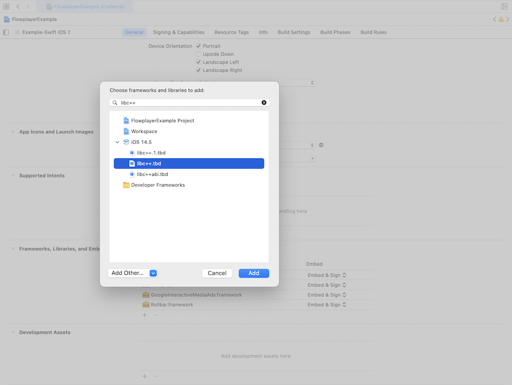

# Migration from v2 to v3

**Module rename**

The main public module that needs to be imported to use Flowplayer SDK has been renamed from:
`FlowplayerCore` to `Flowplayer`. Now `FlowplayerCore` is an internal module and is used by `Flowplayer`
and should not be _used_ or _imported_.

```swift
// import FlowplayerCore << Remove
import Flowplayer
```

**C++ library unlinked**

[Rollbar](https://rollbar.com/error-tracking/ios/) requires the `libc++.tbd` library. This library was previously bundled inside of _Flowplayer SDK_ and would sometimes cause weird behavior and errors when compiled. Because of this it was removed and is now required to be **added by the client**.



## __Installation__

### CocoaPods integration
Use the package manager [CocoaPods](https://cocoapods.org/) to install Flowplayer. Please make sure you have removed the old version of Flowplayer before upgrading to v3.

```bash
# PodFile
pod 'Flowplayer', '3.0.0'
pod 'Rollbar', '1.12.14'
pod 'GoogleAds-IMA-iOS-SDK', '3.14.4'
```

and the run

```bash
pod install
```

### Manual integration

Step 1: Download Flowplayer [here](https://github.com/flowplayer/flowplayer-ios-sdk-public/releases).

Step 2: Add Flowplayer to project.

Step 3: Add FlowplayerCore to project.

Step 4: Add FlowplayerChromecast to project (OPTIONAL).

Step 5: Add Flowplayer dependencies [Google IMA](https://developers.google.com/interactive-media-ads/) and [Rollbar](https://rollbar.com/error-tracking/ios/).

Step 6: Compile and run.

## __Usage__

Follow the official Flowplayer [docs](https://flowplayer.com/developers/ios-sdk/getting-started)
